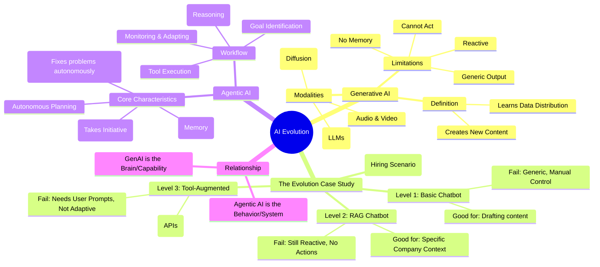

Based on the video transcript from CampusX, here is a detailed summary and a conceptual mind map explaining the evolution from Generative AI to Agentic AI.

---

# Detailed Summary: Generative AI vs. Agentic AI

This video introduces a new playlist on "Agentic AI using LangGraph." The speaker, Nitesh, explains that before diving into the technicals of Agentic AI, it is crucial to understand the difference between Generative AI (GenAI) and Agentic AI, and why the industry is moving toward the latter.

## 1. Understanding Generative AI (GenAI)

**Definition:** Generative AI is a class of AI models capable of creating new content—such as text, images, audio, code, or video—that resembles human-created data.

- **vs. Traditional AI:**
  - **Traditional AI (Classical ML/Deep Learning):** Focuses on finding patterns or relationships between input and output (e.g., classification like spam detection, or regression like price prediction).
  - **Generative AI:** Focuses on learning the **distribution** or nature of the data. Once it understands the distribution (e.g., what a cat looks like), it generates new samples from that distribution rather than just classifying existing ones.

- **Key Modalities & Examples:**
  - **Text:** LLMs like ChatGPT, Gemini, Claude.
  - **Image:** Diffusion models like DALL-E, Midjourney.
  - **Audio/Speech:** Text-to-Speech models like ElevenLabs.
  - **Video:** Models like Sora.

- **Current Applications:** Creative writing, software development (code generation/debugging), customer support (chatbots), education (personalized learning), and design (infographics/ads).

## 2. The Evolution: From Chatbot to Agent

To explain the shift to Agentic AI, the speaker uses a practical scenario: **Hiring a Backend Engineer**. This task involves drafting a Job Description (JD), posting it, screening resumes, scheduling interviews, sending offers, and onboarding.

The video demonstrates four levels of AI implementation to solve this problem:

### Level 1: Basic Generative AI (Standard LLM Chatbot)

- **Workflow:** The user asks the chatbot to draft a JD, draft emails, or suggest interview questions.
- **Pros:** Reduces manual writing effort; creates human-like content.
- **Cons (The Problems):**
  - **Reactive:** The human must prompt every step; the bot takes no initiative.
  - **No Memory:** Lacks context awareness across different days.
  - **Generic:** Produces generic JDs not specific to the company's culture or tech stack.
  - **No Action:** It generates text but cannot post to LinkedIn or send emails.

### Level 2: RAG-Based Chatbot (Knowledge Base Integration)

- **Solution:** The chatbot is connected to company documents (past successful JDs, hiring playbooks, salary bands) using Retrieval-Augmented Generation (RAG).
- **Improvement:** Provides **tailored, company-specific advice** rather than generic outputs.
- **Remaining Cons:** It is still reactive, lacks long-term memory, and cannot execute external actions (cannot click "send").

### Level 3: Tool-Augmented Chatbot (Action Capabilities)

- **Solution:** The chatbot is integrated with tools via APIs (LinkedIn API, Resume Parser, Calendar API, Email API, HRMS).
- **Improvement:** Can perform tasks like posting jobs, parsing PDF resumes, checking calendar availability, and triggering onboarding workflows.
- **Remaining Cons:**
  - **Still Reactive:** The user must explicitly tell it to "post the job" or "schedule the interview".
  - **No Adaptability:** If applications are low, the bot doesn't notice or suggest a fix unless prompted by the user.

### Level 4: Agentic AI (The Final Evolution)

- **Definition:** An AI system that is **proactive, context-aware, autonomous, and adaptable**.
- **Workflow:**
  1.  **Goal Setting:** The user gives a high-level goal: "Hire a backend engineer".
  2.  **Planning:** The Agent understands the goal and creates a plan (Draft JD -> Post -> Monitor -> Screen -> Interview -> Offer).
  3.  **Execution & Monitoring:** It executes steps using tools. Crucially, it **monitors** progress.
  4.  **Adaptability:** If it sees only 2 applications (problem), it autonomously decides to broaden the JD or boost the post (solution), asking the human only for approval.
  5.  **Completion:** It handles end-to-end tasks, including negotiation and onboarding, keeping the human in the loop mainly for approvals.

## 3. Key Differences: GenAI vs. Agentic AI

| Feature          | Generative AI                      | Agentic AI                                |
| :--------------- | :--------------------------------- | :---------------------------------------- |
| **Primary Goal** | Create Content (Text, Image, etc.) | Achieve a Goal (Execute a process)        |
| **Nature**       | Reactive (Waits for prompts)       | Proactive (Takes initiative)              |
| **Operation**    | User guides every step             | Autonomous planning & execution           |
| **Relationship** | GenAI is a tool                    | GenAI is a "building block" of Agentic AI |
| **Concept**      | A **Capability**                   | A **Behavior**                            |

---

# Mind Map: The Evolution of AI Systems

