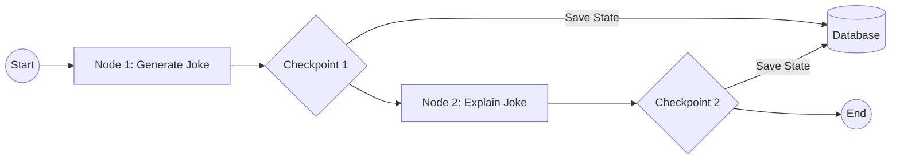
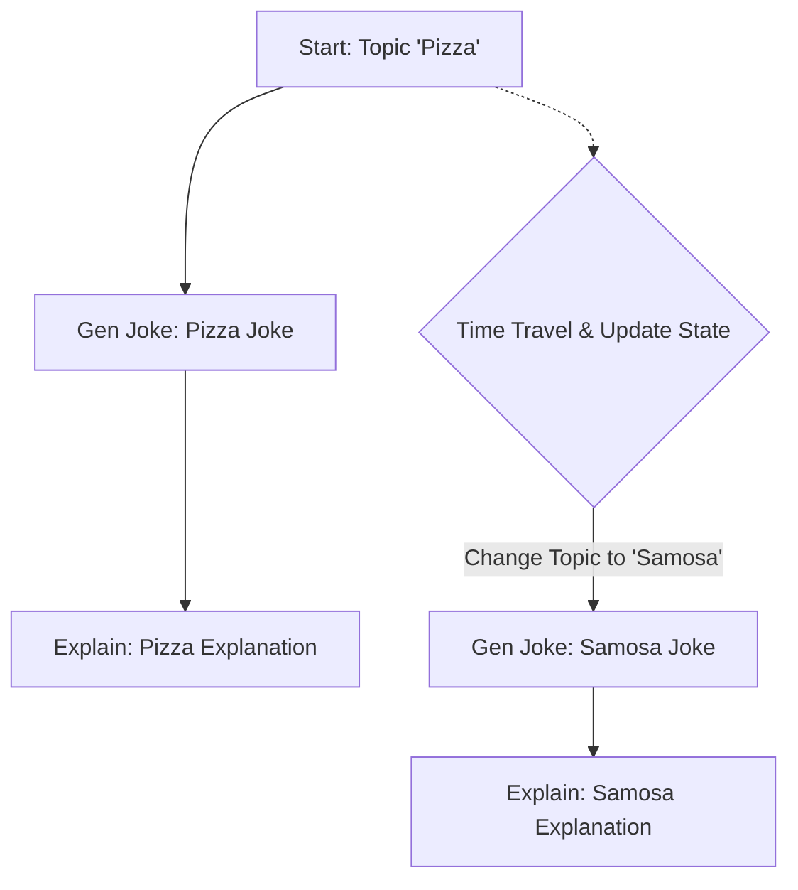

Here is a detailed summary of the "Persistence in LangGraph" lecture, formatted in Markdown with conceptual diagrams.

# Persistence in LangGraph: A Detailed Summary

## 1. Introduction: What is Persistence?

In LangGraph, **Persistence** refers to the ability to save and restore the state of a workflow over time. It is considered a foundational concept because it powers advanced features like chatbot memory, fault tolerance, and human-in-the-loop workflows.

### The Problem: "State Amnesia"

By default, LangGraph workflows are stateless.

1.  A workflow accepts input, processes it through nodes, and updates the state.
2.  Once the execution (invocation) ends, the state is wiped from memory.
3.  If you invoke the graph again, it starts from scratch, having "forgotten" previous interactions.

### The Solution: Persistence

Persistence modifies this behavior by saving the state to a database (or memory) at every step. This allows the system to recall past data and resume workflows from specific points.

---

## 2. Core Concepts

### A. Checkpointers

Persistence is implemented using **Checkpointers**.

- A checkpointer divides the graph execution into "Supersteps" (essentially, every node execution).
- At every Superstep, the checkpointer saves the **current state** (both intermediate and final values) to a database.

**Conceptual Diagram: How Checkpointers Work**



_Note: The checkpointer saves not just the final result, but the state at every intermediate stage._

### B. Storage (MemorySaver vs. Database)

- **In-Memory (`MemorySaver`):** Used for demos and testing. It saves state to RAM. If the program stops, data is lost.
- **Persistent DB:** In production, you use databases like Postgres or Redis (e.g., `PostgresSaver`) to retain data even if the server restarts.

### C. Threads

To manage multiple users or conversations, LangGraph uses **Threads**.

- A `thread_id` acts as a unique key for a specific conversation history.
- When invoking the graph, you provide a config containing the `thread_id`. The checkpointer loads the specific state associated with that ID.

**Diagram: Multi-User Threading**

```text
User A (Thread ID: "1")  --> [Graph] --> Save/Load from DB (Row: "1")
User B (Thread ID: "2")  --> [Graph] --> Save/Load from DB (Row: "2")
```

---

## 3. Implementation Steps

To implement persistence in code, follow these three main steps:

1.  **Initialize Checkpointer:** Import and create a checkpointer instance (e.g., `MemorySaver`).
2.  **Compile with Checkpointer:** Pass the checkpointer when compiling the graph.
3.  **Invoke with Config:** Pass a `thread_id` in the configuration dictionary during invocation.

```python
# Conceptual Code Snippet
from langgraph.checkpoint.memory import MemorySaver

# 1. Initialize Memory
memory = MemorySaver()

# 2. Compile Graph
app = graph.compile(checkpointer=memory)

# 3. Invoke with Thread ID
config = {"configurable": {"thread_id": "1"}}
app.invoke(input_data, config=config)
```

To view the history or current state, you can use:

- `app.get_state(config)`: Returns the current state.
- `app.get_state_history(config)`: Returns a list of all saved snapshots (checkpoints).

---

## 4. Key Benefits of Persistence

The source highlights four major benefits of using persistence.

### 1. Short-Term Memory (Chatbots)

Enables "Resume Chat" functionality.

- By saving the conversation history (state) against a `thread_id`, a user can return days later, and the bot will load previous messages and continue the context.

### 2. Fault Tolerance

If a workflow crashes (e.g., server failure, API timeout) in the middle of execution, persistence allows it to resume from the last successful checkpoint rather than restarting from the beginning.

**Example:**

- **Scenario:** A 3-step workflow. Step 2 has a 30-second delay.
- **Crash:** The system is manually interrupted at Step 2.
- **Recovery:** When re-invoked with `None` as input and the same `thread_id`, the graph detects the saved state at Step 2 and resumes immediately from there, skipping Step 1.

### 3. Human-in-the-Loop (HITL)

Useful when a workflow needs human approval (e.g., posting to LinkedIn).

- The graph pauses execution to wait for user input.
- Because the state is persisted, the graph can stay "paused" for hours or days without keeping active memory resources. Once the human responds, it resumes exactly where it left off.

### 4. Time Travel

This advanced feature allows developers to "replay" or "fork" execution from a specific point in the past.

**How it works:**

1.  **Identify Checkpoint:** Browse `get_state_history` to find the specific `checkpoint_id` where you want to go back (e.g., the point where a topic was set but the joke wasn't generated yet).
2.  **Replay:** Invoke the graph using that `checkpoint_id`. The graph effectively "travels back in time" and re-executes from that point.
3.  **Forking/Editing:** You can use `update_state` to change a value at a past checkpoint (e.g., changing topic from "Pizza" to "Samosa") and run a new execution branch from there.

**Diagram: Time Travel & Forking**



_In the source demo, the speaker successfully updated the state to "Samosa" and generated a new joke path while retaining the original "Pizza" path in history._
