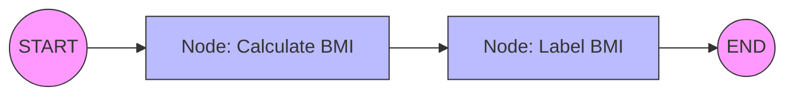
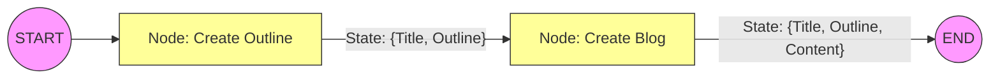

Based on the provided transcript from the "CampusX" YouTube channel, here is a detailed summary of the video on creating **Sequential Workflows in LangGraph**.

### **Introduction: From Theory to Practice**

The video transitions from previous theoretical discussions about Agentic AI to practical implementation. The primary goal is to teach the syntax of LangGraph by building **Sequential Workflows**—linear processes where tasks execute one after another without branching or parallel paths.

The video covers setting up the environment, understanding the core structure of LangGraph code, and building three distinct examples: a BMI calculator, a Simple LLM Q&A, and a Prompt Chaining workflow.

---

### **1. Environment Setup & Prerequisites**

To begin coding in LangGraph, the following setup is required:

- **Virtual Environment:** Create and activate a virtual environment (e.g., `myenv`) to manage dependencies.
- **Installation:** Install the necessary libraries using `pip`:
  - `langgraph`: For building the graph workflows.
  - `langchain`: Provides components like chat models and prompt templates, which LangGraph utilizes.
  - `langchain_openai`: For accessing OpenAI models.
  - `python-dotenv`: To manage environment variables (API keys).
- **Editor:** The instructor uses VS Code and recommends **Jupyter Notebooks** for learning, as they allow for easy visual representation of the graphs.

---

### **2. Core Concepts: The 4-Step Process**

Building a workflow in LangGraph follows a standard four-step procedure:

1.  **Define State:** Create a class inheriting from `TypedDict` to define the data structure (schema) that passes between nodes.
2.  **Define Graph:** Initialize a `StateGraph` object using the defined state.
3.  **Add Nodes & Edges:**
    - **Nodes:** Python functions that perform work and update the state.
    - **Edges:** Define the connections and flow direction (e.g., from Node A to Node B).
4.  **Compile & Execute:** Compile the graph into a runnable application and invoke it with an initial state.

---

### **3. Workflow Example 1: BMI Calculator (Non-LLM)**

This example demonstrates LangGraph syntax without the complexity of LLMs.

- **The State:** A dictionary containing `weight` (float), `height` (float), and `bmi` (float).
- **The Node (`calculate_bmi`):** A function that receives the current state, extracts weight and height, calculates BMI using the formula $Weight / Height^2$, updates the state with the result, and returns it.
- **The Structure:**
  - The graph moves from `START` $\rightarrow$ `Calculate BMI` $\rightarrow$ `END`.

**Extension: Adding Logic (Conditionals)**
The instructor adds a second node to categorize the BMI (e.g., "Overweight", "Normal").

- **Updated State:** Adds a `category` key.
- **New Node:** `label_bmi` checks the calculated BMI value and assigns a category string.

#### **Diagram: Sequential BMI Workflow**

_Figure 1: The linear flow of data where the State is updated at each node._

---

### **4. Workflow Example 2: Simple LLM Integration**

This workflow introduces interaction with OpenAI's models via LangChain.

- **The Goal:** Ask a question and get an answer from an LLM.
- **The State:** Contains `question` and `answer` (strings).
- **The Node (`LLM QA`):**
  1.  Extracts the question from the state.
  2.  Creates a prompt.
  3.  Invokes the model (`ChatOpenAI`).
  4.  Updates the state with the model's response content.
- **Insight:** While this simple task could be done with a single function call, using LangGraph establishes a structure that scales for complex agents.

---

### **5. Workflow Example 3: Prompt Chaining**

This example illustrates **Prompt Chaining**, where a task is decomposed into a series of sequential LLM calls.

- **The Scenario:** Generating a blog post from a topic.
- **The Logic:**
  1.  **Step 1:** Generate a detailed outline based on the topic.
  2.  **Step 2:** Generate the full blog content using the topic _and_ the generated outline.
- **The State:**
  - `title` (Input)
  - `outline` (Intermediate output)
  - `content` (Final output).

**Nodes Implementation:**

1.  **`Create Outline` Node:** Takes the title, prompts the LLM for an outline, and saves it to the state.
2.  **`Create Blog` Node:** Takes both the title and the outline from the state, prompts the LLM to write the blog, and saves the text to the state.

#### **Diagram: Prompt Chaining Workflow**

_Figure 2: The state "evolves" as it passes through the chain, accumulating data._

### **Key Advantages of LangGraph over LangChain Chains**

The instructor highlights a critical benefit of LangGraph used in the Prompt Chaining example. In traditional LangChain chains, obtaining intermediate outputs (like the "Outline") alongside the final output can be difficult. In LangGraph, because the **State** persists and accumulates data throughout the entire flow, the final output contains everything: the original title, the generated outline, and the final blog content.

### **Homework**

The video concludes with a challenge to extend the Prompt Chaining workflow by adding a third node: **Evaluate Blog**. This node should take the generated content and outline, score the quality of the blog, and add that score to the state.
