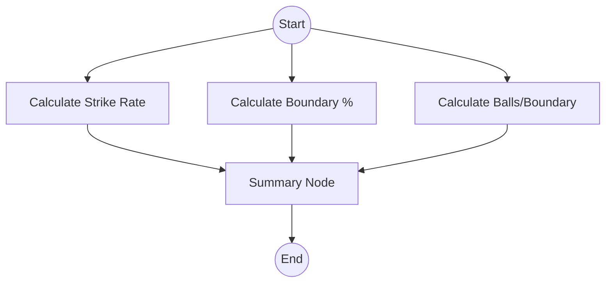
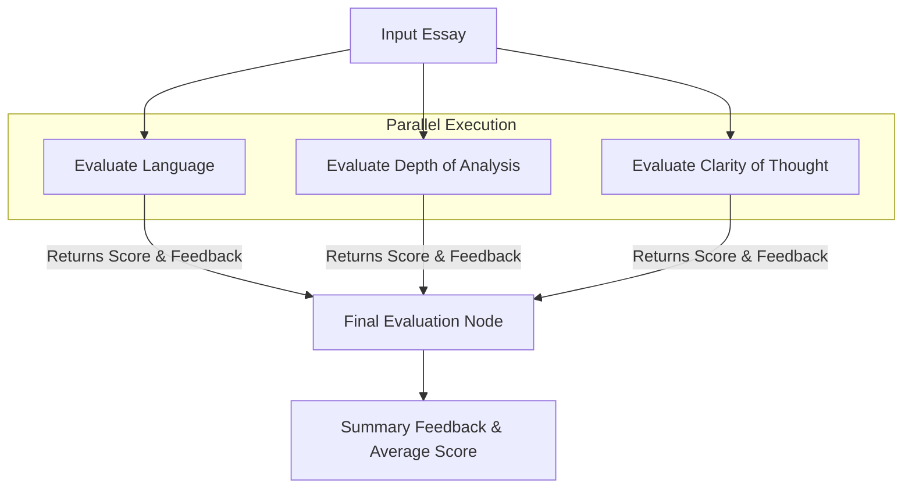

Here is a detailed summary of the video "Parallel Workflows in LangGraph," including diagrams and code concepts as presented in the source material.

### **Overview**

The video focuses on moving beyond sequential (linear) workflows to building **Parallel Workflows** using LangGraph. The instructor demonstrates this through two examples: a simple, non-LLM calculation workflow (Cricket Stats) and a complex, LLM-based workflow (UPSC Essay Evaluator). The tutorial covers essential concepts such as handling state conflicts via partial updates, ensuring structured outputs from LLMs, and using reducer functions to merge parallel outputs.

---

### **1. Concept: Parallel Workflows vs. Sequential Workflows**

In previous videos, the workflows were linear. In a parallel workflow, a single state is passed to multiple nodes simultaneously. These nodes execute independently, and their outputs are eventually merged or passed to a subsequent node.

#### **Key Challenge: State Conflicts**

When multiple nodes execute in parallel, they all receive the same input state. If every node returns the entire state object back to the graph, LangGraph detects a conflict (e.g., three nodes trying to "update" the `runs` key simultaneously, even if they didn't change it). This results in an `InvalidUpdateError`.

**Solution:** **Partial State Updates**. Nodes should only return the specific key-value pairs they calculated, rather than the entire state dictionary.

---

### **2. Example 1: Cricket Statistics (Non-LLM)**

#### **Goal**

Create a system that takes raw batsman data (Runs, Balls, 4s, 6s) and calculates three independent metrics in parallel:

1.  Strike Rate
2.  Boundary Percentage
3.  Balls Per Boundary
    Finally, generate a textual summary.

#### **Workflow Diagram**



#### **Implementation Details**

- **State Definition:** A dictionary containing input fields (runs, balls, etc.) and output fields (strike_rate, boundary_percent, etc.).
- **Parallel Execution:**
  - The `Start` node connects to three calculation nodes via `graph.add_edge`.
  - **Node 1 (Strike Rate):** Calculates `(runs / balls) * 100`. Returns `{'strike_rate': value}`.
  - **Node 2 (Balls Per Boundary):** Calculates `balls / (4s + 6s)`. Returns `{'bpb': value}`.
  - **Node 3 (Boundary %):** Calculates `((4s*4 + 6s*6) / runs) * 100`. Returns `{'boundary_percent': value}`.
- **Aggregation:** All three nodes connect to a `Summary` node, which reads the calculated values from the state and creates a final string summary.

---

### **3. Example 2: UPSC Essay Evaluator (LLM-Based)**

#### **Goal**

Evaluate an essay using three different "expert" LLMs in parallel. Each LLM evaluates a specific aspect:

1.  **Language:** Quality of writing.
2.  **Depth of Analysis:** Content depth.
3.  **Clarity of Thought:** Logical flow.

The system must output a **summarized textual feedback** and a **final average score** (0-10).

#### **Workflow Diagram**



#### **Key Technical Concepts**

**A. Structured Output (Pydantic & JSON)**
To ensure the LLM returns a reliable score (integer) and feedback (string) rather than unstructured text, the instructor uses `ChatOpenAI` with `.with_structured_output()`.

- **Schema:** A Pydantic class `EvaluationSchema` is defined with fields `feedback` (str) and `score` (int, 0-10).
- **Benefit:** Prevents errors where the LLM might write "Seven" instead of `7`, ensuring mathematical operations can be performed later.

**B. The Reducer Function (`operator.add`)**
The state needs to store scores from three parallel nodes into a single list called `individual_scores`.

- **The Problem:** If three nodes try to write to `individual_scores` simultaneously, they might overwrite each other.
- **The Solution:** Use `Annotated` and `operator.add` in the state definition. This tells LangGraph that when multiple nodes return a value for `individual_scores`, those values should be **added (appended)** to the existing list rather than replacing it.

**State Code Snippet:**

```python
class UPSCState(TypedDict):
    # ... other fields ...
    individual_scores: Annotated[list[int], operator.add]
    # This allows parallel nodes to append scores like,, into.
```

#### **Workflow Logic**

1.  **Parallel Nodes:** Three nodes define specific prompts (e.g., "Evaluate Language..."). Each calls the structured LLM and returns a dictionary: `{'language_feedback': text, 'individual_scores': [score]}`.
2.  **Final Evaluation Node:**
    - **Text Summary:** Takes the three distinct feedback strings and sends them to an LLM to generate a merged summary.
    - **Score Calculation:** Takes the `individual_scores` list (which now contains 3 integers thanks to the reducer) and calculates the average: `sum(scores) / len(scores)`.

### **Summary of Best Practices**

1.  **Partial Updates:** Always prefer returning partial dictionaries (only modified keys) from nodes to prevent state conflicts, especially in parallel execution.
2.  **Structured Output:** When calculations depend on LLM output, enforce a schema to guarantee data types.
3.  **Reducers:** When parallel nodes must contribute to the same state variable (like a list of scores), use reducer functions like `operator.add` to merge results instead of overwriting them.
