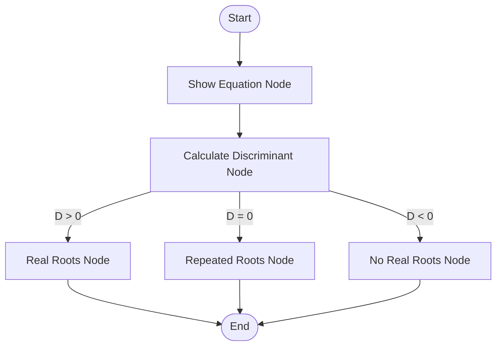
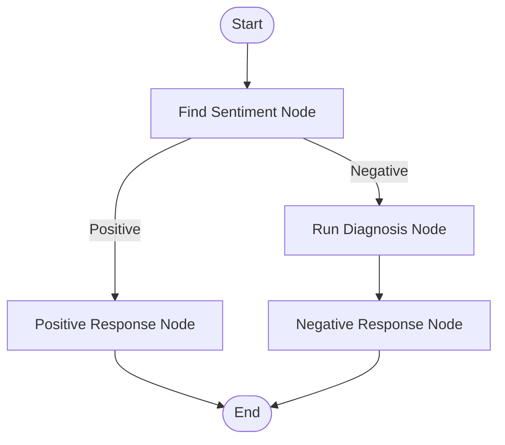

Here is a detailed summary of the video "Conditional Workflows in LangGraph," including diagrams and implementation details based on the provided transcript.

### **Overview: Conditional Workflows in LangGraph**

This video, the seventh in the "Agentic AI using LangGraph" playlist, focuses on **Conditional Workflows**. Previously, the series covered sequential workflows (linear tasks) and parallel workflows (executing multiple branches simultaneously).

**Key Concept:**
A conditional workflow functions like an **if-else** statement in programming. Unlike parallel workflows where execution enters all branches, a conditional workflow evaluates a specific condition to decide which **single branch** to execute. This is a fundamental concept for building complex, logic-driven AI agents.

---

### **Part 1: Non-LLM Example - Quadratic Equation Solver**

To demonstrate the concept without the complexity of an LLM, the video builds a workflow that solves quadratic equations ($ax^2 + bx + c = 0$).

#### **The Logic**

The workflow calculates the **Discriminant** ($D = b^2 - 4ac$) to determine the nature of the roots:

- **If $D > 0$:** Two distinct real roots exist.
- **If $D = 0$:** One repeated real root exists.
- **If $D < 0$:** No real roots exist.

#### **Workflow Diagram**

#### **Implementation Details**

1.  **State Definition (`QuadState`):** A dictionary containing coefficients ($a, b, c$), the formatted equation string, the discriminant (float), and the final result string.
2.  **Nodes:**
    - `Show Equation`: Formats and stores the equation string.
    - `Calculate Discriminant`: Computes $b^2 - 4ac$.
    - Three branch nodes: `Real Roots`, `Repeated Roots`, and `No Real Roots`, each applying the relevant mathematical formula.
3.  **Conditional Logic:**
    - A routing function named `check_condition` is created. It takes the state as input, checks the value of the discriminant, and **returns the name of the next node** (e.g., "Real Roots" or "No Real Roots").
    - The graph uses `graph.add_conditional_edges` instead of standard edges to connect the Discriminant node to the three possible outcomes based on the routing function.

---

### **Part 2: LLM-Based Example - Customer Support Agent**

The second example builds a more complex workflow using OpenAI's models to handle customer reviews.

#### **The Logic**

The system receives a customer review and determines the sentiment.

- **Positive Sentiment:** Generate a "Thank You" message immediately.
- **Negative Sentiment:** Perform a deep diagnosis (identify Issue Type, Tone, and Urgency) before generating an empathetic, resolution-oriented response.

#### **Workflow Diagram**

#### **Implementation Details**

**1. Structured Output & State**

- The system uses **Structured Output** (JSON format) to ensure reliability.
- **Sentiment Schema:** A simple schema extracting `sentiment` as either "Positive" or "Negative".
- **Diagnosis Schema:** For negative reviews, the LLM extracts:
  - `Issue Type` (e.g., Bug, UX).
  - `Tone` (e.g., Frustrated).
  - `Urgency` (Low, Medium, High).

**2. The Nodes**

- **`Find Sentiment`:** Uses an LLM to classify the review text.
- **`Positive Response`:** Generates a warm thank-you note requesting feedback on the website.
- **`Run Diagnosis`:** (Only for negative reviews) Analyzes the specific problem and emotional tone.
- **`Negative Response`:** Uses the diagnosis data (issue, tone, urgency) to draft a helpful resolution message.

**3. Conditional Routing**

- A function `check_sentiment` examines the extracted sentiment from the state.
  - If `Positive` $\rightarrow$ returns `"Positive Response"`.
  - If `Negative` $\rightarrow$ returns `"Run Diagnosis"`.
- The graph connects the `Find Sentiment` node using `add_conditional_edges`, routed by `check_sentiment`.

### **Key Takeaways for LangGraph**

- **Routing Function:** To implement branching, you must write a Python function that inspects the current state and returns the **string name** of the next node to execute.
- **`add_conditional_edges`:** This is the specific method used to register the branching logic in the graph, replacing the standard `add_edge` for that specific transition.
- **Structured Output:** When using LLMs for flow control (like deciding between branches), enforcing structured output (Pydantic/JSON) is highly effective for reliability.
