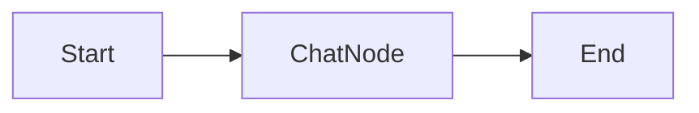

Here is a detailed summary document of the provided source material, formatted in Markdown with conceptual diagrams.

# Building a Context-Aware Chatbot with LangGraph

## 1. Project Overview & Roadmap

This project is part of an "Agentic AI" series using LangGraph. After covering fundamentals (sequential, parallel, and looping workflows), the objective is to build a complex, feature-rich chatbot.

**Planned Evolution of the Chatbot:**

- **Core Feature:** Basic conversation with memory (Current focus).
- **RAG (Retrieval-Augmented Generation):** Answering queries from documents.
- **Tool Integration:** Performing actions via external tools.
- **Advanced Features:** UI integration, Human-in-the-Loop (HITL), Retry logic, and Fault tolerance.

---

## 2. System Architecture

### The Workflow Design

The chatbot is designed as a simple **Sequential Workflow** consisting of a single node responsible for generating responses.

**Diagram: Basic Workflow**



- **Start:** Receives the user input (e.g., "What is the capital of India?").
- **Chat Node:** An LLM processes the input and generates a response (e.g., "New Delhi").
- **End:** The workflow terminates, ready for the next loop.

### The State Schema

In LangGraph, the "State" is crucial for passing data between nodes.

- **Class:** `ChatState` (inherits from `TypedDict`).
- **Attribute:** `messages`.
- **Data Type:** A list of `BaseMessage` objects. This allows handling various message types like `HumanMessage`, `AIMessage`, `SystemMessage`, and `ToolMessage`.

### The Reducer Function

By default, LangGraph replaces the state value with the new return value. To maintain conversation history, a **reducer** is required.

- **Problem:** Without a reducer, every new message overwrites the previous one.
- **Solution:** Use the `add_messages` function from `langgraph.graph.message`.
- **Functionality:** It acts as an optimized append operator, adding new messages to the existing list rather than replacing them.

---

## 3. Phase 1: The "Amnesia" Problem (Stateless Implementation)

Initially, the chatbot is implemented using a `while` loop that takes user input and calls `chatbot.invoke`.

**The Issue:**
Although the system functions as a chatbot, it fails to retain context.

- _Example:_ If a user says "My name is Nitish" and subsequently asks "What is my name?", the bot replies that it does not know.

**Root Cause Analysis:**

- Every time `invoke` is called within the loop, the graph starts a **fresh execution**.
- The State is initialized from scratch.
- Once the workflow hits the "End" node, the state is wiped from memory. The next invocation has no access to the previous interaction's data.

**Diagram: Stateless Execution Failure**

```text
[Iteration 1]
User: "Hi, I'm Nitish"
   ↓
[Graph Execution] -> State: ["Hi..."]
   ↓
[End] -> State is Lost (Wiped)

[Iteration 2]
User: "Who am I?"
   ↓
[Graph Execution (New)] -> State: ["Who am I?"] (Previous context missing)
   ↓
LLM Response: "I don't know."
```

---

## 4. Phase 2: Implementing Persistence (Memory)

To solve the context loss, **Persistence** is implemented using Checkpointers.

### Concept: Checkpointers

Checkpointers allow the graph to save its state at the end of an execution step so it can be reloaded later.

- **Storage:** Can be a database (for production) or RAM (for testing).
- **Component Used:** `MemorySaver` from `langgraph.checkpoint.memory`.

### Implementation Steps

1.  **Initialize Memory:** Create a `MemorySaver` object (RAM-based memory).
2.  **Compile with Checkpointer:** Pass the memory object when compiling the graph: `graph.compile(checkpointer=memory)`.
3.  **Thread Configuration:**
    - To support multiple conversations (e.g., User A vs. User B), a `thread_id` is used.
    - A config dictionary is passed during invocation: `config = {"configurable": {"thread_id": "1"}}`.

### How Persistence Works

When the chatbot is invoked with a valid `thread_id`:

1.  **Fetch:** LangGraph checks the memory for an existing state associated with that `thread_id`.
2.  **Append:** The new user message is added to the retrieved history using the `add_messages` reducer.
3.  **Execute:** The LLM processes the full conversation history.
4.  **Save:** The updated state is serialized and saved back to memory when the workflow ends.

**Diagram: Persistent Workflow**

```text
[Iteration 1]
User: "Hi, I'm Nitish"
   ↓
[Graph] -> Update State
   ↓
[Save to RAM (Thread_ID: 1)]

[Iteration 2]
User: "Who am I?"
   ↓
[Load from RAM (Thread_ID: 1)] -> State: ["Hi, I'm Nitish", "Who am I?"]
   ↓
[Graph Processes Full History]
   ↓
LLM Response: "Your name is Nitish."
```

### Limitations

Since `MemorySaver` uses RAM, the memory is volatile. If the script/kernel is restarted, the conversation history is lost. For long-term retention across restarts, a database-backed checkpointer is required.

---

## 5. Summary Code Structure

Below is a conceptual structure of the final implementation based on the transcript:

```python
from langgraph.checkpoint.memory import MemorySaver
from langgraph.graph.message import add_messages

# 1. Define State
class ChatState(TypedDict):
    messages: Annotated[list[BaseMessage], add_messages]

# 2. Define Node Function
def chat_node(state):
    # Invoke LLM with current history
    return {"messages": [llm.invoke(state["messages"])]}

# 3. Build Graph
memory = MemorySaver()
graph = StateGraph(ChatState)
graph.add_node("chat_node", chat_node)
graph.add_edge(START, "chat_node")
chatbot = graph.compile(checkpointer=memory)

# 4. Interaction Loop with Threads
config = {"configurable": {"thread_id": "1"}}

while True:
    user_input = input("Type Here: ")
    # The config ensures the bot loads the specific history for this thread
    chatbot.invoke({"messages": [HumanMessage(content=user_input)]}, config=config)
```

This setup ensures the chatbot acts like a real application, remembering names, mathematical context (e.g., adding to previous results), and conversation flow.
